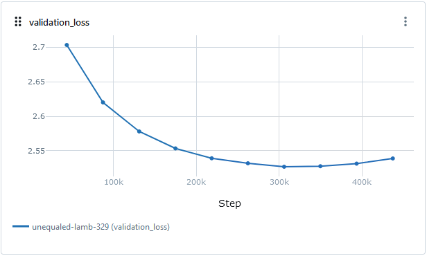
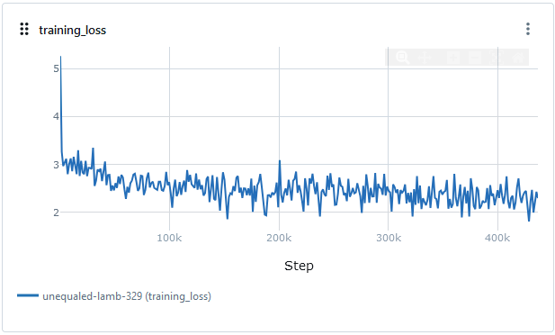
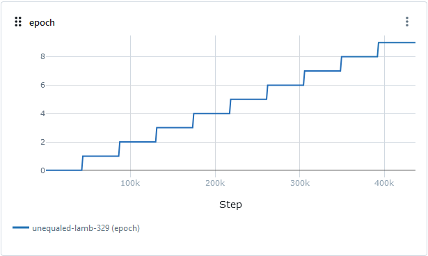
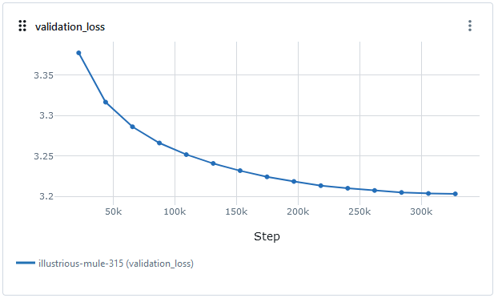
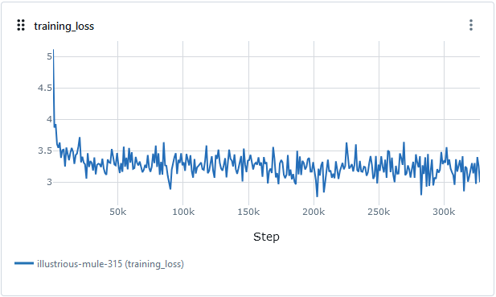
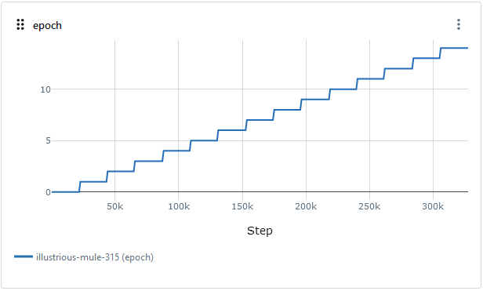
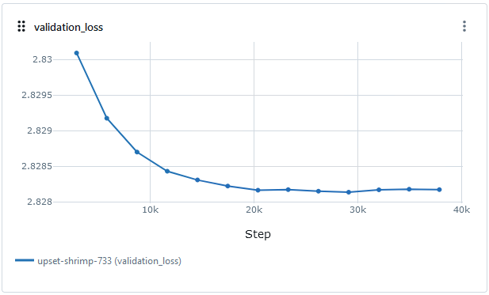

# Скрипты обучения моделей

В этом каталоге содержатся скрипты, которые использовались для обучения моделей.

## Fine-tuning модели T5

Основная модель для генерации отзывов была получена путем дообучения всех параметров базовой модели ruT5-small (64 миллиона параметров). Обучение проводилось на очищенном и обогащенном ключевыми словами датасете. Для обучения потребовалось 10 эпох. Процесс логировался в MLFlow.

Для этого использовался скрипт `scripts/train_t5.py`.







Полученная модель генерирует реалистичные отзывы для рейтинга 5. Для других вариантов качество хуже. Дисбаланс количества отзывов по рейтингам, который был выявлен в EDA, проявился на результатах генерации.

Была проведена оценка на 100 случайно сгенерированных отзывах (в файле [t5_sample.txt](t5_sample.txt)). В результате получена доля корректных отзывов: `0.87`, 95% доверительный интервал: `(0.79, 0.92)`.

## Использование алгоритма LoRa на всем датасете

Также в процессе решения задачи модель была обучена с использованием алгоритма LoRa. Использовалась исходная модель ruT5-small с модификацией слоев (LoRa). Для обучения было добавлено 176 тысяч параметров, остальные параметры были заморожены. Обучение было ограничено 15-ю эпохами.

Для этого использовался скрипт `scripts/train_lora.py`

Используемые параметры LoRa:
```
LoraConfig(
    task_type=TaskType.SEQ_2_SEQ_LM,
    r=4,
    lora_alpha=16,
    lora_dropout=0.01,
    target_modules=["q", "v"],
)
```







Полученная модель показала плохие результаты. Сгенерированные отзывы даже с рейтингом 5 по большей части оказались далеки от реалистичных. Только небольшая часть похожа на реальные. Возможно для исправления этой проблемы помог бы подбор гиперпараметров, но из-за длительного времени обучения этого сделать не удалось.

## Использование алгоритма LoRa на части датасета

В рамках экперимента с использованием алгоритма LoRa модель была обучена на части датасета с рейтингами равными 1 и 2.

Для этого использовался скрипт `scripts/train_lora_r1.py`

В этом случае использовались другие параметры LoRa:
```
LoraConfig(
    task_type=TaskType.SEQ_2_SEQ_LM,
    r=16,
    lora_alpha=1,
    lora_dropout=0.01,
    target_modules=["k", "q", "v"],
)
```

В этом случае обучение длилось 12 эпох. Луший результат был достигнут на 9 эпохе.



Результат оказался лучше, чем в варианте использования LoRa на всем датасете (в т.ч. из-за изменения параметров), но не лучше, чем у модели обученной без использования LoRa.
